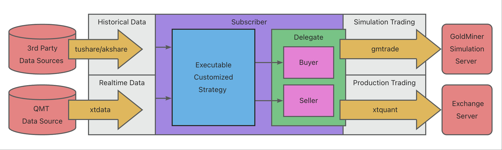

# SilverQuant

**English** | [简体中文](README_CN.md)

[](https://www.python.org/)
[](https://www.apache.org/licenses/LICENSE-2.0)
[](https://www.myquant.cn/)

---

> On investing, there are two rules:
>
> Rule No. 1: Never lose money.
>
> Rule No. 2: Never forget Rule No. 1.
>
> — Warren Edward Buffett

---

Say it out loud three times: start with light paper trading. Light paper trading? Light paper trading! 🤤

Please read this guide before asking questions. Ignorance can be fixed; laziness cannot. 🙄

If you find this project useful, please star the repo so the author stays motivated to keep improving it. 😘

There is currently no official paid channel for this project. Please verify authenticity and beware of impersonators. 🥸

GitHub deployment on mainland China servers can be inconvenient. A mirror is available here: [Gitee mirror](https://gitee.com/silver6wings/silverQuant)


# Overview

SilverQuant is an out-of-the-box, fully automated China A-share trading framework built on [MiniQMT](https://dict.thinktrader.net/nativeApi/start_now.html).

It helps newcomers to quantitative trading get past most of the technical setup hurdles and run strategies locally.

Its modular design lets you quickly prototype ideas, run paper tests, and switch to live trading with one flag.

# Highlights

* Supports 24/7 fully automated trading
* One-flag switch between paper trading and live trading
* Pre-built components for common tasks; custom components supported
* Backtesting is not supported yet

# Design

> The `release_x.x.x` branch is the stable release line.

> The `main` branch is the latest pending release.

> The `develop` branch is the active development line with the newest changes.
>
> Full change history: [[CHANGELOG]](_doc/CHANGELOG.md)

Architecture overview for contributors and extenders:



Data sources

> Historical data: mainly third-party `AKShare`, `Tushare`, `TDX`, and MiniQMT built-in sources

> Intraday data: mainly tick-level data from `MiniQMT`

Strategy

> Strategies can run at configurable intervals, processing the latest cross-section data in seconds with a customizable subscription universe

Trading

> Supports QMT live trading and MyQuant paper trading, including market orders, limit orders, and cancellations

> TWAP, VWAP, and iceberg order algorithms are not supported yet


# Quick Start

## System Requirements

> Windows is required. Most domestic trading software ecosystems do not support macOS or Linux.

## Software Downloads

> GitHub Desktop
> 
> https://desktop.github.com/

> PyCharm CE for Windows (Community Edition is enough; Professional is not required)
> 
> https://www.jetbrains.com/pycharm/download/?section=windows
> 
> *Note: [VSCode](https://code.visualstudio.com/) is not recommended for beginners because setup is more involved.*

> Broker edition QMT (ask your broker relationship manager to enable QMT access first)
> 
> As of late 2024, brokers supporting QMT can be found [here](https://www.bilibili.com/opus/1014402646051651589). Example from [one broker](https://miniqmt.com/):
> 
> WinRAR
> 
> https://www.win-rar.com/start.html?&L=0
> 
> https://www.rarlab.com/download.htm
> 
> Example broker QMT (live)
> 
> https://download.gjzq.com.cn/gjty/organ/gjzqqmt.rar
> 
> Example broker QMT (simulation)
> 
> https://download.gjzq.com.cn/temp/organ/gjzqqmt_ceshi.rar

> For iWencai LLM features, install Node.js v16+
>
> https://nodejs.org/

> For paper trading before live deployment, install MyQuant Terminal 3
> 
> https://www.myquant.cn/terminal

> For data/strategy separation architectures, install Redis. Windows MSI packages are available here:
>
> https://github.com/MicrosoftArchive/redis/releases


## Environment Setup

Clone the repository locally

> Clone directly in GitHub Desktop
> 
> Or run `gh repo clone silver6wings/SilverQuant` in a terminal, then open it in GitHub Desktop

Open the cloned SilverQuant folder in PyCharm: File > Open, then select the SilverQuant directory

Install Python 3.10 (the author's stable development version; not mandatory, but likely the fewest surprises)
 
> 1. Install from PyCharm, or
> 2. Download from the official site: https://www.python.org/downloads/release/python-31010/

Install dependencies
 
> In PyCharm, open Terminal and run: `pip install -r requirements.txt`
> 
> *Note: if Terminal was already open, close and reopen it until you see something like `(venv)` before running the command*

If installation is slow, append a mirror URL with ` -i [mirror_url]`

> Available mirrors
> 
> * https://pypi.tuna.tsinghua.edu.cn/simple/
> * https://pypi.mirrors.ustc.edu.cn/simple/
> * http://pypi.mirrors.ustc.edu.cn/simple/
> * http://mirrors.aliyun.com/pypi/simple/

## Launch

### Start QMT

Launch your broker edition of XunTou QMT in `Minimal Mode` (newer versions call it `Standalone Trading`). Confirm the data source connection status in the lower-left corner is healthy.

### Start MyQuant Client (Paper Trading)

When running in paper mode (`IS_PROD = False`), in addition to configuring `GM_XXX`, you must open the MyQuant Terminal 3 client before starting the strategy. After logging in, connect the corresponding simulation account in the terminal (the `GM_ACCOUNT_ID` configured in `credentials.py`). Confirm the trading service is connected before launching the script.

### Configure Credentials

> Copy `credentials_sample.py` in the project root to `credentials.py` and fill in your own values
> 
> 1. `AUTHENTICATION`: key for remote strategy push services; leave empty if unused
> 2. `CACHE_BASE_PATH`: local strategy cache directory; default is usually fine
> 3. `QMT_XXX`: account ID and QMT install path; run QMT once if you cannot find `userdata_mini`
> 4. `DING_XXX`: DingTalk group bot settings; create a group bot to obtain the webhook URL
> 5. `GM_XXX`: paper trading settings; obtain MyQuant secret tokens yourself

### Set Up a DingTalk Bot

> If you want DingTalk notifications, create a notification group with at least three members
>
> 1. Group settings: Bot -> Add Bot -> Custom Bot -> Add
> 2. Security: Sign -> obtain `DING_SECRET`
> 3. Accept the terms and continue
> 4. Copy the webhook URL to obtain `DING_TOKENS`
> 5. Save both values in `credentials.py`

### Set Up MyQuant Paper Trading

> If you want paper trading, install MyQuant Terminal 3 first (download link above)
> 
> 1. New users can register with a mobile number
> 2. In `System Settings`, open Token Management to obtain `GM_CLIENT_TOKEN`
> 3. In `Account Management`, add a simulation account and configure simulated funding and commission rates
> 4. In account management, use `Copy Account ID` to obtain `GM_ACCOUNT_ID`
> 5. Save both values in `credentials.py`
> 6. Before every paper-trading run, open the MyQuant client and connect that simulation account, or orders will fail

### Run a Script

> Open the SilverQuant project root in PyCharm
> 
> 1. Find a `run_xxxxxx.py` file in the project root
> 2. Find `IS_PROD = False`; change it to `True` to switch to live trading
> 3. Paper mode (`IS_PROD = False`): confirm the MyQuant client is open and connected to the simulation account; live mode (`IS_PROD = True`): confirm QMT is running
> 4. Run `run_xxxxxx.py` with the green play button

# Entry Points

The project includes several ready-to-run strategy launchers.

Because QMT allows only one instance per OS session, run one strategy at a time when possible to avoid conflicts.

```
run_wencai_qmt.py
Uses Tonghuashun iWencai LLM for stock selection and buying.
Define your prompt in `selector/select_wencai.py`.
Good for rapid prototyping and paper testing; plan for at least one month of testing.
For more complex sell logic, refer to `run_remote.py` and add historical data download code.

run_wencai_tdx.py
Uses iWencai and Tongdaxin data sources; can run paper trading without the QMT client.
```
```
run_remote.py
For Linux or distributed big-data scenarios.
You can host your own signal service; the program reads data over HTTP and executes buys.
```
```
run_shield.py
Semi-automatic workflow: manual buys, quantitative sells.
```
```
run_swords.py
Board-hitting template: buys when a stock hits the limit-up board and conditions are met. Needs tuning.
```
```
run_swords_tdx.py
Same board-hitting template, but the watchlist comes from a local Tongdaxin custom list.
```
```
run_ai_gen.py
Advanced learning sample for formula-based stock selection. Not recommended for live trading.
```

# Advanced Configuration

> See the advanced configuration guide: [[CONFIGURATION]](_doc/CONFIGURATION.md)

# Known Issues

> Entry prices are read directly from `Mini QMT` and are not adjusted dynamically for corporate actions. Ex-dividend price drops may trigger unintended stop-loss sells.
> 
> Libraries such as Akshare and Pywencai are often rate-limited or IP-banned by data sites. Control request volume carefully.
> 
> Tushare historical daily data may be unadjusted. When using historical data, note that tick `lastClose` may not match yesterday's close.
> 
> ETF daily data coverage is incomplete, so daily-indicator sell strategies may silently fail for ETFs during testing.

# FAQ

### About QMT

If the program stops printing to the console, check whether the market data source is configured correctly in QMT.

### About setup

Restart the system before first launch to refresh all software configuration.

### About node.js

If you see errors like the one below while using pywencai, your Node.js version may be too new. This is usually not critical.

Downgrade Node.js or set `NODE_NO_WARNINGS=1` to suppress the warning.

```
(node:44993) [DEP0040] DeprecationWarning: The `punycode` module is deprecated. Please use a userland alternative instead.
(Use `node --trace-deprecation ...` to show where the warning was created)
```

### About pywencai

pywencai has been unstable recently. Try [pywencai-enhanced](https://github.com/HeRiki/pywencai-enhanced) as an alternative:
```
$ pip install git+https://github.com/HeRiki/pywencai-enhanced.git
```
```
pywencai scrapes data from https://www.iwencai.com/.
Install Node.js first, then restart PyCharm at least once.
Otherwise you may see: 'NoneType' object has no attribute 'get'
Also verify your stock-selection prompt works on the website.
Use an interval of 30 seconds or longer to reduce IP bans.

$ pip install pywencai --upgrade
```

### About akshare

```
akshare scrapes public data from official websites; site redesigns can break scrapers.
akshare is updated frequently; upgrading to the latest version often helps.
```

```
$ pip install akshare --upgrade
```

### About tushare

Register at [tushare.pro](https://tushare.pro/register?reg=430410) to obtain a token.

```
tushare is a fallback data source for akshare and requires a configured token.
The framework supports multiple tokens; see credentials_sample.py TUSHARE_TOKEN.
Note: free Tushare daily data is unadjusted only; adjusted data requires a paid plan. Consider the impact on your strategy.
```

### About mytt

The framework includes parts of [MyTT](https://github.com/mpquant/MyTT).

```
Enhanced versions are also provided for core functions that do not support dynamic parameters in the original library.
```

---

# Disclaimer

This project is licensed under Apache 2.0.

* Do not rush into live trading. Even after validation, start with a small live position first.
* The author is not liable for any losses caused by use of this code. Use it in compliance with applicable regulations.
* Suggestions and bug reports are welcome via [Issues](https://github.com/silver6wings/SilverQuant/issues) or pull requests.


# Acknowledgements

* Thanks to [@owen590](https://github.com/owen590) for valuable feedback from the very first line of code to today
* Thanks to [@dominicx](https://github.com/dominicx) for a PR that fixed trading edge cases the author had not covered
* Thanks to [@nackel](https://github.com/nackel) for a PR adding Feishu bot support
* Thanks to [@vipally](https://github.com/vipally) for a PR improving parts of MyTT formulas and VS Code configuration


# About the Author

The author is a long-time corporate employee with no background in financial institutions.

Quantitative trading is a hobby project. There are certainly rough edges, and your understanding is appreciated.

For deeper issues, resources, or collaboration inquiries, add the author's WeChat work account with your star count and GitHub ID: `junchaoyu_`

There is also an active support community for technical discussion. All traders are welcome.
